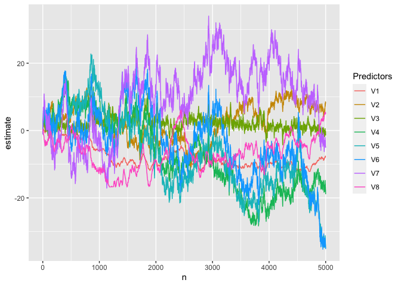
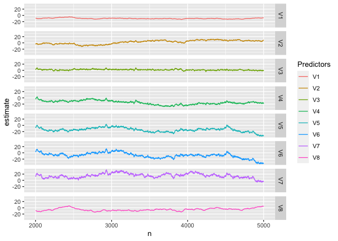

MH algorithm–version 2
================
Ngoc Duong
5/8/2020

``` r
raw_dat = read.csv(file.path(getwd(), "hurrican356.csv")) %>%
  janitor::clean_names() %>%
  mutate(id = str_sub(id, end = -6L)) %>%
  group_by(id) %>%
  mutate(n = 1,
         t = cumsum(n) - 1) %>% # create t variable grouped by hurrican
  select(-n)

## 80-20 train/test data split ***by hurricane***
hurricane_names = unique(raw_dat$id) # unique hurricanes

set.seed(1)
ind = sample(hurricane_names, size = length(hurricane_names)*0.8) # sample hurricanes with probability 0.8 for training
train = raw_dat %>% # data for train hurricanes
  filter(id %in% ind)
test = raw_dat %>% # data for test hurricanes
  filter(!(id %in% ind))
```

``` r
train_clean = train %>% rename(year = season) %>% 
  separate(time, into = c("date", "hour"), sep = " ") %>% 
  mutate(hour = str_replace(hour, ":00:00\\)", ""),
         hour = as.numeric(hour),
         date = str_replace(date, "\\(", ""),
         date = yday(date),
         nature = as.numeric(as.factor(nature))) %>% 
  group_by(id) %>% 
  mutate(n_latitude = lag(latitude,1),
         n_longitude = lag(longitude,1),
         n_windkt = lag(wind_kt,1),
         diff_long = c(NA, diff(longitude)),
         diff_lat = c(NA, diff(latitude)),
         diff_windkt = c(NA, diff(wind_kt))) %>% 
  ungroup() %>% 
  na.omit() %>% 
  select(id, wind_kt, n_windkt, date, year, nature, diff_lat, diff_long, diff_windkt)

train_test = filter(train_clean, id == "ALLISON")
  
XX = train_test %>% mutate(intercept = 1) %>% 
  select(intercept, date:diff_windkt) %>% as.matrix()

YY = train_test %>% select(wind_kt) %>% as_vector()
```

### Find log-likelihood

Betas ~ indep MVN, rho ~ truncated normal, Sigma ~ inverse-gamma

``` r
## Sigma is a vector of beta_k variances
## X is vector of observations
## mu_X??
## rho is scalar

ll_f = function(X, Y, beta, Sigma, rho) {
  #invsigma = diag(1/Sigma)
  mu_X = t(X) %*% diag(beta) + rho*Y
  
  a = log(Sigma)
  b = (X - t(mu_X)) %*% (1/Sigma) %*% t(X - t(mu_X))
  c = 7*log(2*pi)
  
  l = -0.5*(as.vector(a + b) + c)
  return(sum(l))
}


ll_beta = function(Sigma, X) {
  invsigma = diag(1/Sigma)
  
  a = log(Sigma)
  b = t(X) %*% invsigma %*% X
  c = 7*log(2*pi)
  
  l = -0.5*(as.vector(a + b) + c)
  return(l)
}

###################################
ll_rho = function(rhos) {
  # Prior for correlation rho between time points
  prob = dtruncnorm(rhos, a = 0, b = 1, mean = 0.5, sd = sqrt(0.2))
  return(log(prob))
}

ll_sigma = function(sigma) {
  # Prior for the inverse of the error covariance matrix
  return(log(dinvgamma(sigma, 0.0001, 0.0001)))
}

ll_beta = function(betas) {
  return(sum(log(dnorm(betas, mean = 0, sd = 1))))
}

###################################

ll_rho = function(rho) {
  a = log(sqrt(5))
  b = log(dnorm(sqrt(5)*(rho - 0.5)))
  c = log(pnorm(sqrt(5)/2) - pnorm(-sqrt(5)/2))
  
  l = a + b - c
  return(l)
}

ll_invSigma = function(Sigma) {
  invsigma = diag(1/Sigma)

  a = 0.001*log(0.001)
  b = log(factorial(0.001 - 1))
  c = 1.001*log(invsigma)
  d = 0.001/invsigma
  
  l = a - b + c + d
  return(diag(l))
}


logpost_all = function(X, Y, beta, rho, Sigma){    
  return(ll_beta(beta) + ll_sigma(Sigma) + ll_rho(rho) + ll_f(X, Y, beta, Sigma, rho))
}
```

### MH algorithm

``` r
MH_step = function(train_X, train_Y, params, b_avec, r_a, sig_a){
  
  # cast X as matrix 
  train_X = unname(train_X) %>% as.matrix
  bnum = vector(length = 7)
  bdenom = vector(length = 7)

  # initialize parameter vectors
  bb = c() # beta vec
  rr = NA # rho
  ss = NA # Sigma
  
  p_betas = cur_betas = params[1:7]
  cur_rho = p_rho = rho = params[8]
  cur_sigma = params[9]
  
  # estimate Betas
  for (j in 1:7) {
    
    cur_betas = p_betas
    p_betas = cur_betas + (runif(1) - 0.5) * 2 * b_avec
    bnum[j] = logpost_all(train_X, train_Y, beta = p_betas, rho = cur_rho, Sigma = cur_sigma)
    bdenom[j] = logpost_all(train_X, train_Y, beta = cur_betas, rho = cur_rho, Sigma = cur_sigma)
    ## Assign posterior values (component-wise, since logpost_all gives vector)
    if (log(runif(1)) < (bnum[j] - bdenom[j])) {
      bb[j] = p_betas[j]
    } else {
      bb[j] = cur_betas[j]}
  }
  
    #sampling rhos
    p_rho = cur_rho + (runif(1) - 0.5) * 2 * r_a
    rnum = logpost_all(train_X, train_Y, beta = bb, rho = p_rho, Sigma = cur_sigma)
    rdenom = logpost_all(train_X, train_Y, beta = bb, rho = cur_rho, Sigma = cur_sigma)
  #cur_rho = p_rho 
  if (log(runif(1)) < (rnum - rdenom)) {
      rr = p_rho
    } else {
     rr = cur_rho}
  
    #sampling sigmas
    p_sigma = cur_sigma + (runif(1) - 0.5) * 2 * sig_a
  snum = logpost_all(train_X, train_Y, beta = bb, rho = cur_rho, Sigma = p_sigma)
  sdenom = logpost_all(train_X, train_Y, beta = bb, rho = cur_rho, Sigma = cur_sigma)
  p_sigma = cur_sigma
  if (log(runif(1)) < (snum - sdenom)) {
      ss = p_sigma
    } else {
      ss = cur_sigma}
    
  #rr = p_rho
  #ss = p_sigma

  return(c(bb, rr, ss))
}
```

Run MCMC

``` r
# first, specify the avecs and parameter starting values
#b_avec = c(0.3, rep(0.7,6)) #c(10, rep(2, 5), 5)
#avec = c(b_avec, r_a, sig_a)

beta_start = rep(0, 7)
sigma_start = 100
rho_start = 0.5
p_start = c(beta_start, rho_start, sigma_start)

nrep = 5000
mchain <- matrix(NA, nrow = nrep, ncol = 9)
mchain[1, ] <- p_start

set.seed(7)
for (i in 2:nrep) {
  mchain[i, ] = MH_step(train_X = XX[10, ], # estimates must be made for each row (hour t)
                        train_Y = YY[10], 
                        params = mchain[i - 1, ], 
                        b_avec = c(0.25, rep(0.75,6)),
                        r_a = 0.5,
                        sig_a = 0.2)
}
```

``` r
par(mfrow = c(4, 2))
for (k in 1:7) {
  plot(mchain[501:1000, k], type = "l", ylab = k - 1)
}

numunique(mchain[, 1:7])
for (i in 1:ncol(mchain)) {
  cat(i, "\t", mean(mchain[501:1000,i]), "\n")
} 
```

Visualize on full chain

``` r
as_tibble(mchain) %>% 
  mutate(n = c(1:5000)) %>% 
  pivot_longer(V1:V8, 
               names_to = "Predictors",
               values_to = "estimate") %>% 
  ggplot(aes(x = n, y = estimate, group = Predictors, col = Predictors)) + 
  geom_line()
```

    ## Warning: `as_tibble.matrix()` requires a matrix with column names or a `.name_repair` argument. Using compatibility `.name_repair`.
    ## This warning is displayed once per session.

<!-- -->

``` r
as_tibble(mchain) %>% 
  mutate(n = c(1:5000)) %>% 
  pivot_longer(V1:V8, 
               names_to = "Predictors",
               values_to = "estimate") %>% 
  ggplot(aes(x = n, y = estimate, group = Predictors, col = Predictors)) + 
  geom_line() +
  facet_grid(Predictors~.)
```

<!-- -->

We can also discard the first 501 values in the chain as “burnin”. This
is a way to select only the last 501 values for betas and rhos

``` r
#run the chain
burned = mchain[2001:5000, ]
```

Visualize on burned out chain

``` r
 as_tibble(burned) %>%  mutate(n = c(2001:5000)) %>% 
  pivot_longer(V1:V8, 
               names_to = "Predictors",
               values_to = "estimate") %>% 
  ggplot(aes(x = n, y = estimate, group = Predictors, col = Predictors)) + 
  geom_line() +
  facet_grid(Predictors~.)
```

<!-- -->

Next, we might first check the probability of accepting the proposals
for each parameter in order to tune the choice ofa. Here’s a useful
utility for calculating this:

``` r
numunique <- function(mat){
  for(i in 1:ncol(mat)) {
    cat(i,"\t",length(unique(mat[,i])),"\n")
  }
}

#for betas (1-7), rhos (8), and sigma (9)
numunique(mchain[, 1:9])
```

    ## 1     1974 
    ## 2     5000 
    ## 3     5000 
    ## 4     5000 
    ## 5     5000 
    ## 6     5000 
    ## 7     5000 
    ## 8     2447 
    ## 9     1

``` r
#for rhos
#numunique(mchain[, 8])

#for sigma?
#numunique(mchain[, 9])
```
